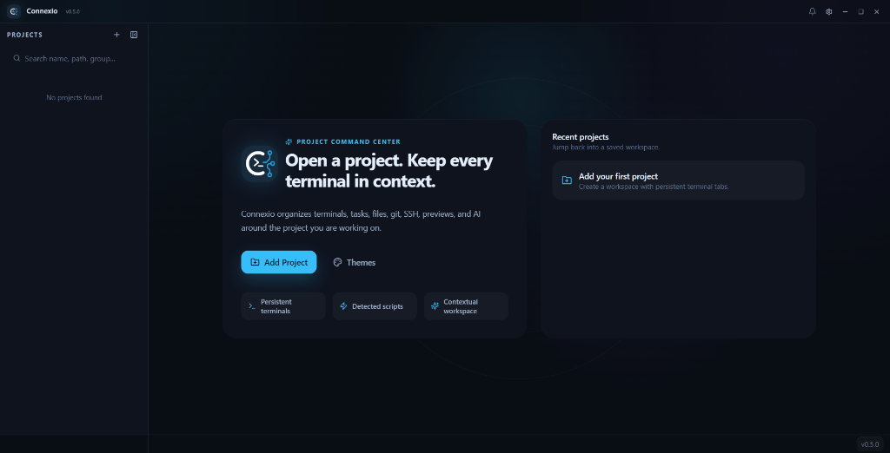

  
<code>Project-Based Terminal Workspace</code>

  <h1>CONNEXIO</h1>
  <h2>the project-based terminal manager.</h2>

 

<table width="100%">
  <tr valign="top">
    <td width="33%">
      <code>01 / PERSISTENCE</code>  
      Tabs, layout environments, and directory sessions survive application restarts automatically.
    </td>
    <td width="33%">
      <code>02 / AUTOMATION</code>  
      Auto-detects scripts from package.json, Makefile, Cargo.toml, pyproject.toml with single-click runner.
    </td>
    <td width="33%">
      <code>03 / GET STARTED</code>  
      <a href="https://github.com/ReyyyGITHUB/connexio-landing">Download for Windows</a> 
      <a href="https://github.com/ReyyyGITHUB/connexio-landing">GitHub</a>
    </td>
  </tr>
</table>

 

  

